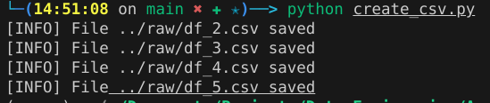
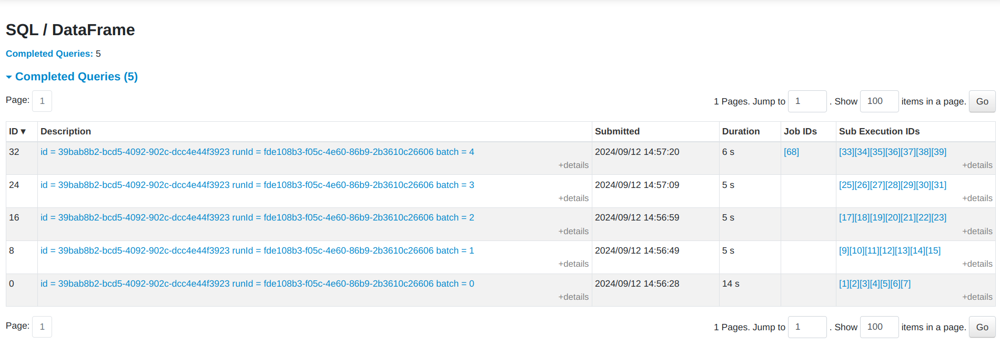

* **PySpark ETL Pipeline for New York City Airbnb Data** *

Project Overview
This pipeline is designed to:

Ingest new CSV files from a directory, tracking files to avoid duplicate processing.
Transform the data by cleaning, filtering, and adding calculated columns.
Load the transformed data into partitioned Parquet files.
Query the data using SQL-like queries in PySpark.

Directory Structure
The pipeline expects the following directory structure:

/your_project_directory/

├── data/              # Contains data to split in raw folder

├── raw/              # Contains raw CSV files to be processed

├── processed/        # Contains processed Parquet files

├── logs/             # Contains logs and metadata

├── scripts/          # Contains Python scripts (e.g., spark_etl.py)

└── README.md         # This README file

Prerequisites:

- Python 3.x
- Apache Spark
- PySpark
- Java 8 or 11
- Kaggle API (optional, if downloading data directly from Kaggle)

Instalation
Install PySpark: Install Apache Spark and PySpark on your local machine.

*pip install pyspark*

To check version of pyspark:
pyspark --version

Download Airbnb Data: Download the New York City Airbnb Open Data CSV file from Kaggle and place it in the data/ directory.

Directory Setup: Make sure the raw/, processed/, and logs/ directories are created in your project directory.
To do it:

*mkdir raw processed logs*

Configure Environment Variables: Set up SPARK_HOME and PYSPARK_PYTHON environment variables, if necessary.

Start the Spark Job: Execute the ETL pipeline using the following command:

*spart-submit /path/to/your_project_directory/scripts/spark_etl.py*

This will start the ETL process and stream data from the raw/ directory, transform it, and save it in the processed/ directory as partitioned Parquet files.

Monitor Spark Jobs: Use the Spark Web UI available at http://localhost:4040 to monitor the execution and status of your Spark jobs.

In other terminal run script to generate batch of csv files:

python /path/to/your_project_directory/scripts/create_csv.py

It will generate every 10 seconds csv in raw/ folder

RESULTS:

Questions about this project:

1. How to see sql query result save it in a separate file, or mb there is ability to show result in SPARK UI?
2. How to perform loging in this project? Or in other any project, im not familiar with logging at all.
3. Is it a good way to do all tasks separtly with using notebook, and then build all together? Or better starts with scripts?
4. I can give a access to this github repo, to code review. I'd like to get more feedback, if its possible.
